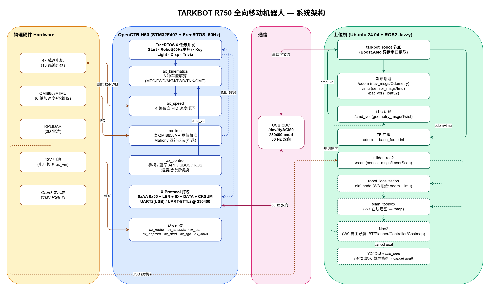

# tarkbot-r750-study

塔克创新 TARKBOT R750 全向移动自主作业机器人 —— 3 个月学习仓库（ROS2 Jazzy 版）。

> 在校学生学习记录，从 STM32 固件 → ROS2 驱动 → SLAM → Nav2 自主导航全链路打通。

## 系统架构

> 4 层泳道：物理硬件 → STM32+FreeRTOS → USB CDC 通信 → ROS2 上位机。雷达走 USB 旁路直接给上位机。源文件 [`architecture.drawio`](./docs/images/architecture.drawio) 可用 [app.diagrams.net](https://app.diagrams.net) 打开编辑。

## 硬件

- **底盘**：TARKBOT R750（麦克纳姆轮 / 阿克曼 / 差速 / 履带 / 三轮全向 6 种车型可配置）
- **主控**：OpenCTR H60 V3.6（STM32F407VET6, 168MHz）
- **IMU**：QMI8658A（6 轴）
- **上位机**：Ubuntu 24.04 + ROS2 Jazzy
- **仿真器**：Gazebo Harmonic

## 学习计划

📋 主计划：[`学习计划-3个月-ROS2-Jazzy版.md`](./学习计划-3个月-ROS2-Jazzy版.md)（517 行，12 周节奏）

| 阶段 | 周 | 主线 |
|---|---|---|
| 1 仿真起步 | W1–W4 | Python 仿真 + URDF + Gazebo Harmonic |
| 2 SLAM 实战 | W5–W8 | 真车 + slam_toolbox + cartographer + Nav2 AMCL + EKF |
| 3 导航闭环 | W9–W12 | Nav2 自主导航 + YOLO 加分 + 简历投递 |

📋 ROS1 备查版：[`学习计划-3个月.md`](./学习计划-3个月.md)（保留作工具链对照）

## 技术笔记

- [`技术笔记-FreeRTOS架构.md`](./技术笔记-FreeRTOS架构.md) —— 6 任务架构 / 优先级 / 临界区
- [`技术笔记-IMU与里程计概念.md`](./技术笔记-IMU与里程计概念.md) —— 加速度 / 陀螺仪 / 里程计计算
- [`技术笔记-ROS架构与节点.md`](./技术笔记-ROS架构与节点.md) —— 话题 / 服务 / TF / launch
- [`技术笔记-运动学与IMU姿态估计.md`](./技术笔记-运动学与IMU姿态估计.md) —— 6 种车型运动学 + Mahony 互补滤波

🎨 交互式：[`四元数可视化.html`](./四元数可视化.html)（浏览器打开）

## 项目文档

- [`docs/superpowers/specs/`](./docs/superpowers/specs/) —— 设计 spec
- [`docs/superpowers/plans/`](./docs/superpowers/plans/) —— 实施计划

## 进度

- [x] W1.1 Ubuntu 24.04 + ROS2 Jazzy 环境
- [x] W1.2 修复并编译 `tarkbot_robot` ROS2 包（在 `~/ros2_ws`）
- [x] W1.4 GitHub 仓库 + 笔记 push
- [ ] W1.5 Mermaid 架构图
- [x] W1.6 项目阅读笔记 V1（≥4500 字，[查看](./项目阅读笔记-V1-STM32到ROS全链路.md)）
- [ ] W2 Python 数学仿真（5 个脚本）
- [ ] W3 URDF + RViz2
- [ ] W4 Gazebo Harmonic
- [ ] W5+ 真车阶段（等硬件）

## License

学习材料 / 笔记原创内容采用 [CC BY 4.0](https://creativecommons.org/licenses/by/4.0/) 许可。
仓库不包含厂商提供的源码 / 资料 / 视频（已在 `.gitignore` 屏蔽）。

---

> 灵感来自塔克创新官方资料包 + [Anthropic Claude Code](https://claude.com/claude-code) 协助迭代。
